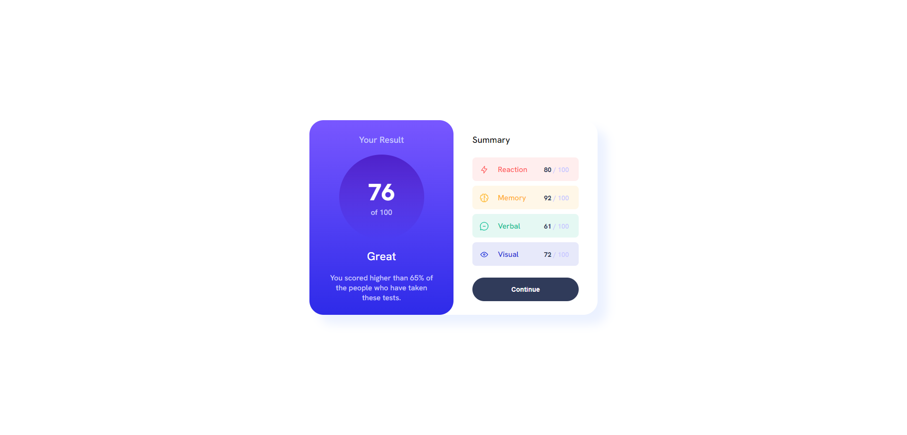

# Frontend Mentor - Results summary component solution

This is a solution to the [Results summary component challenge on Frontend Mentor](https://www.frontendmentor.io/challenges/results-summary-component-CE_K6s0maV). Frontend Mentor challenges help you improve your coding skills by building realistic projects.

## Table of contents

- [Overview](#overview)
  - [The challenge](#the-challenge)
  - [Screenshot](#screenshot)
  - [Links](#links)
- [My process](#my-process)
  - [Built with](#built-with)
  - [What I learned](#what-i-learned)
  - [Continued development](#continued-development)
  - [Useful resources](#useful-resources)
- [Author](#author)
- [Acknowledgments](#acknowledgments)

## Overview

### The challenge

Users should be able to:

- View the optimal layout for the interface depending on their device's screen size
- See hover and focus states for all interactive elements on the page
- **Bonus**: Use the local JSON data to dynamically populate the content

### Screenshot



### Links

- Solution URL: [Add solution URL here](https://github.com/BooGu7/results-summary-component)
- Live Site URL: [Add live site URL here](https://boogu7.github.io/results-summary-component/)

## My process

### Built with

- Semantic HTML5 markup
- CSS custom properties
- CSS Grid
- Mobile-first workflow
- JavaScript

### What I learned

Use a forEach loop in JavaScript to get data from a JSON file

```css
display: grid;
grid-template-columns: 20% 50% 10% 20%;
```

```js
data.forEach(function (item, index) {
  const taskDiv = document.createElement("div");
  taskDiv.className = `task task${index + 1}`;
  taskDiv.innerHTML = `
      
      <div class="content type${index + 1}">${item.category}</div>
      <div class="number-1">${item.score}</div>
      <div class="number-2">/ 100</div>
    `;
  detailDiv.appendChild(taskDiv);
});
```

### Continued development

Continue to develop features and use material ui to increase the experience.

### Useful resources

- [forEach method](https://developer.mozilla.org/en-US/docs/Web/JavaScript/Reference/Global_Objects/Array/forEach) - This method helps me to get element values in data.json

## Author

- Website - [Boo](https://boo-portfolio-project.vercel.app/)
- Frontend Mentor - [@Boo](https://www.frontendmentor.io/profile/BooGu7)
- Linkedin - [Boo](https://www.linkedin.com/in/tr%E1%BB%8Dng-t%C3%B4n-th%E1%BA%A5t-b5028b265/)

## Acknowledgments

Thank myself.
